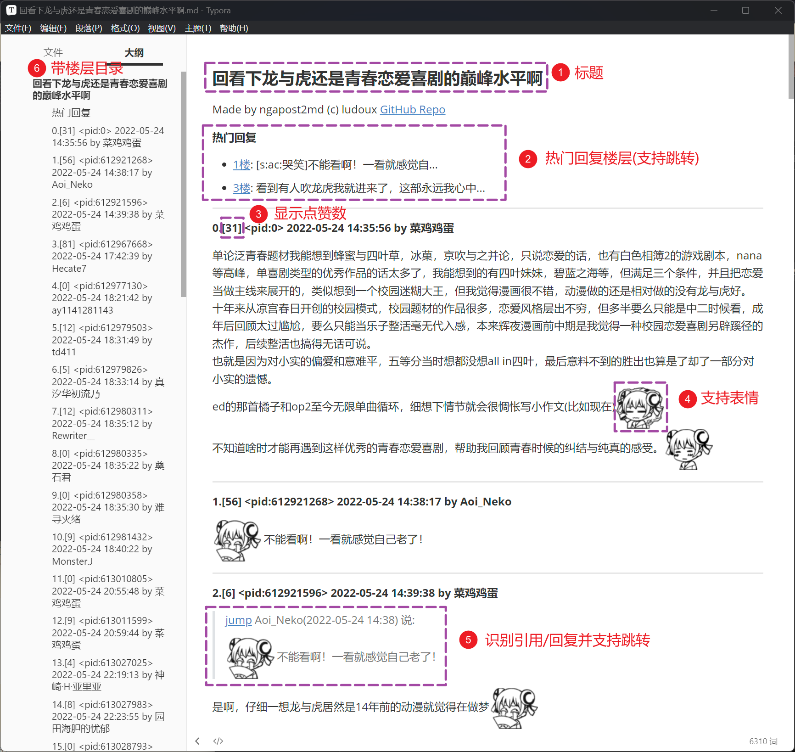

# ngapost2md ver.[NEO_1.5.1]

ngapost2md 是一个将 NGA 论坛帖子转换为 Markdown 格式的工具。它支持快速爬楼并存储回复人、时间和内容，同时支持保存正文图片。

*程序主要在 Linux 平台下开发，若您在使用上发现关于跨平台兼容性的问题（特别是目录分隔符相关），欢迎提 issue*

**此为 2023 年由 Go 语言重写的版本。倘若需要旧版 Python 版代码（不再维护），请切换分支至 LEGACY**



## 使用说明
1. 下载并解压发布版本的压缩包。
2. 修改 config.ini 文件中的配置项，根据需要进行相应的修改，确保 `config.ini`  文件存在且与可执行文件在同一目录下（平级关系）。
3. 打开终端或命令提示符。
4. 运行以下命令，并执行程序：

linux
```
./ngapost2md 5935947
```
windows
```
.\ngapost2md.exe 5935947
```
参数为帖子的 tid，如上述命令里的 5935947。

5. 程序会开始爬取帖子内容并将其转换为 Markdown 格式，转换后的文件将保存在当前目录。

参数详情
```
> ./ngapost2md -h

使用: ngapost2md tid [--force-no-check-update] [--dump-update-info]
选项与参数说明: 
tid: 待下载的帖子 tid 号
--force-no-check-update      在编译时间后的不少于 60 天内，不检测版本更新
--dump-update-info           当检测到新版本时，将版本信息原始文件写入 NEED_UPDATE 文件

ngapost2md -v, --version     显示版本信息并退出
ngapost2md -h, --help        显示此帮助信息并退出
ngapost2md --gen-config-file 生成默认配置文件于 config.ini 并退出
```

## 配置说明

详见注释 [config.ini](https://github.com/ludoux/ngapost2md/blob/neo/assets/config.ini)

在 release 页面的打包文件中，config.ini 文件与主程序平级。假如需要生成新的默认配置文件，可使用 `--gen-config-file` 参数。此会覆盖 config.ini 为默认配置。

**不要试图在 config.ini 内添加新条目或者增加、修改注释。软件每次启动都会舍弃此类外界变动并重新保存 config.ini 文件。**

## 注意事项


- 请确保您的网络连接正常，并且能够访问 NGA 论坛。
- 请遵守 NGA 论坛的相关规定和版权要求。
- 请使用合法、合规的方式进行爬取，遵守网站的爬虫规范和使用协议。
- 请尊重网站的服务器负载和带宽限制，避免对其造成过大的压力。
- 请避免频繁的请求和大量的并发连接，以免对网站的正常运行造成干扰。
- 转换过程可能需要一些时间，具体时间取决于帖子的页数和内容数量。

## 资瓷与不资瓷格式说明

资瓷的有：

- newline 换行
- pic 图片（会下载下来）
- smile 表情（只是引用在线资源）
- quote 回复与引用（阔以 jump 和 append 在最后 [#12](https://github.com/ludoux/ngapost2md/issues/12)）（多个 quote [#33](https://github.com/ludoux/ngapost2md/issues/33)）
- strikeout 删除线
- url 超链接
- anony 匿名 （[#11](https://github.com/ludoux/ngapost2md/issues/11)）
- 用户基于 IP 的位置 （[#45](https://github.com/ludoux/ngapost2md/pull/45)）

不资瓷并且常出现的有：
- ~~align 对齐~~ 目前 Go 版本不支持
- ~~collapse 折叠 （[#10](https://github.com/ludoux/ngapost2md/issues/10)）~~ 目前 Go 版本不支持
- ~~audio 音频 （[#15](https://github.com/ludoux/ngapost2md/issues/15)）~~ 目前 Go 版本不支持
- ~~video 音频~~ 目前 Go 版本不支持
- 字体颜色啊大小之类的格式
- 表格之类的复杂排版

## Special Thanks

- 特别感谢 [zsq @oarinv](https://github.com/oarinv) 的协助！
- 特别感谢 [crella6](https://github.com/crella6) 的捉虫以及意见！
- 感谢 [proItheus](https://github.com/proItheus) 对此项目的帮助！
