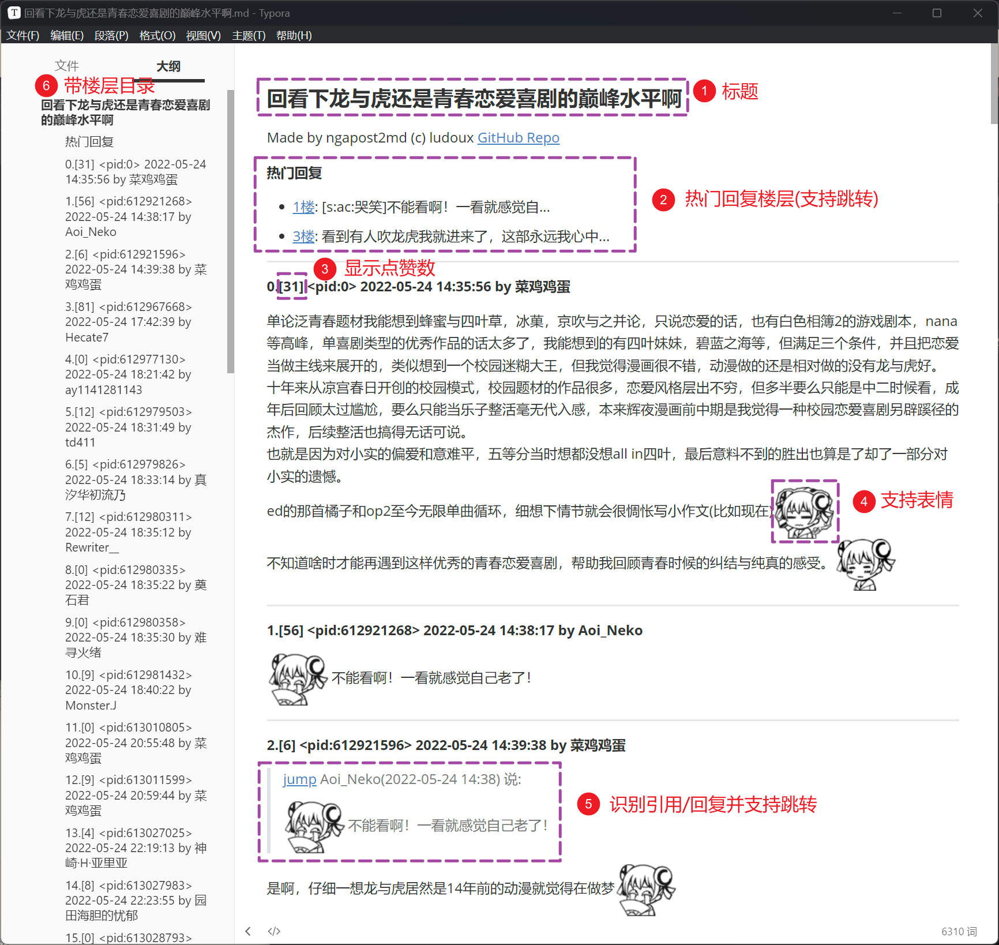

# ngapost2md ver.[NEO_2.0.0]

ngapost2md 是一个将 NGA 论坛帖子转换为 Markdown 格式的工具。它支持快速爬楼并存储回复人、时间和内容，同时支持保存正文图片。

*程序主要在 Linux 平台下开发，若您在使用上发现关于跨平台兼容性的问题（特别是目录分隔符相关），欢迎提 issue*

**此为 2023 年由 Go 语言重写的版本。倘若需要旧版 Python 版代码（不再维护），请切换分支至 LEGACY**



## ngamm - 为 ngapost2md 提供的一个简单的管理工具 (友好广告)
- https://github.com/i2534/ngamm

## NGA-Post-Saver - NGA 帖子存档助手 (友好广告)
- https://github.com/xhoxye/NGA-Post-Saver

## 使用说明

无责任推荐一个有人味的[使用说明甲](https://bbs.nga.cn/read.php?tid=44054712)和[使用说明乙](https://bbs.nga.cn/read.php?tid=45832408)。但是假如提需求提建议请不要在这些帖子里头发（因为这个不是我写的）。部分信息可能会变化，请以下述以及 Release 页面为最新内容。

1. 下载并解压发布版本的压缩包。
2. 修改 config.ini 文件中的配置项，根据需要进行相应的修改，确保 `config.ini`  文件存在且与可执行文件在同一目录下（平级关系）。
3. 打开终端或命令提示符，**并确保终端所在目录即为程序所在目录，否则程序可能无法正确读取配置文件**。
4. 运行以下命令，并执行程序：

linux
```
./ngapost2md 5935947
```
windows
```
.\ngapost2md.exe 5935947
```
参数为帖子的 tid，如上述命令里的 5935947。

5. 程序会开始爬取帖子内容并将其转换为 Markdown 格式，转换后的文件将保存在当前目录。

参数详情
```
> ./ngapost2md -h

ngapost2md github.com/ludoux/ngapost2md
使用: ngapost2md tid [--authorid aid]
或:  ngapost2md url [--authorid aid]
或:  ngapost2md serve [--host ip] [--port port] [--password pwd] [--no-ui]
选项与参数说明: 
tid: 待下载的帖子 tid 号
url: NGA帖子的链接，例如: https://nga.178.com/read.php?tid=123&authorid=456
aid: 只看某用户 id 发言层，需配合 --authorid 参数

ngapost2md -v, --version     显示版本信息并退出
ngapost2md -h, --help        显示此帮助信息并退出
ngapost2md -u, --update      检查最新版本
ngapost2md --gen-config-file 生成默认配置文件于 config.ini 并退出
```

## 配置说明

详见注释 [config.ini](https://github.com/ludoux/ngapost2md/blob/neo/assets/config.ini)

在 release 页面的打包文件中，config.ini 文件与主程序平级。假如需要生成新的默认配置文件，可使用 `--gen-config-file` 参数。此会覆盖 config.ini 为默认配置。

**不要试图在 config.ini 内添加新条目或者增加、修改注释。软件每次启动都会舍弃此类外界变动并重新保存 config.ini 文件。**

## 注意事项


- 请确保您的网络连接正常，并且能够访问 NGA 论坛。
- 请遵守 NGA 论坛的相关规定和版权要求。
- 请使用合法、合规的方式进行爬取，遵守网站的爬虫规范和使用协议。
- 请尊重网站的服务器负载和带宽限制，避免对其造成过大的压力。
- 请避免频繁的请求和大量的并发连接，以免对网站的正常运行造成干扰。
- 转换过程可能需要一些时间，具体时间取决于帖子的页数和内容数量。
- 此工具无意过度研究如何绕过网页盾。

## 资瓷与不资瓷格式说明

资瓷的有：

- newline 换行
- pic 图片 ~~（会下载下来）~~ 可以选择下载或者不下载下来，参考 [#109](https://github.com/ludoux/ngapost2md/issues/109)
- audio 音频 [#103](https://github.com/ludoux/ngapost2md/issues/103)
- video 视频 [#103](https://github.com/ludoux/ngapost2md/issues/103)
- smile 表情（只是引用在线资源）
- quote 回复与引用（阔以 jump 和 append 在最后 [#12](https://github.com/ludoux/ngapost2md/issues/12)）（多个 quote [#33](https://github.com/ludoux/ngapost2md/issues/33)）
- strikeout 删除线
- url 超链接
- anony 匿名 [#11](https://github.com/ludoux/ngapost2md/issues/11)
- 用户基于 IP 的位置 [#45](https://github.com/ludoux/ngapost2md/pull/45)

不资瓷并且常出现的有：
- ~~align 对齐~~ 目前 Go 版本不支持
- ~~collapse 折叠 （[#10](https://github.com/ludoux/ngapost2md/issues/10)）~~ 目前 Go 版本不支持
- 字体颜色啊大小之类的格式
- 表格之类的复杂排版

## Server 模式

ngapost2md 支持以 HTTP Server 模式运行，提供 Web 前端界面和 REST API，方便远程管理和定时任务。

### 启动 Server

```
./ngapost2md serve [--host 0.0.0.0] [--port 8080] [--password your_password] [--no-ui]
```

| 参数 | 简写 | 默认值 | 说明 |
|---|---|---|---|
| `--host` | | `0.0.0.0` | 绑定 IP，也可在 config.ini `[server].host` 中配置 |
| `--port` | `-p` | `8080` | 监听端口，也可在 config.ini `[server].port` 中配置 |
| `--password` | | 从 config.ini `[server].password` 读取 | Basic Auth 密码，**未设置时自动生成并写入 config.ini** |
| `--no-ui` | | `false` | 禁用 Web 前端，仅提供 API |

密码优先级：`--password` 命令行参数 > `config.ini` `[server].password`。若两者均未设置，程序将自动生成一个随机密码并保存到 config.ini。

启动后浏览器访问 `http://localhost:8080`，用户名 `admin`，密码为上述设置的密码。

### 认证方式

- **Session Cookie（Web 前端）**：通过登录页 `/login.html` 登录，服务端维持 72 小时有效的 session，Cookie 名称 `ngapost2md_session`
- **Basic Auth（API 客户端）**：用户名固定 `admin`，密码同上
- **WebSocket**：支持 Session Cookie（浏览器自动携带）或 URL 参数 `?token=base64(admin:password)`
- **公开路由**（无需认证）：`POST /api/login`、`POST /api/logout`、`GET /api/version`、`/login.html`

### 前端页面

- **下载帖子**：输入 tid 或 NGA URL，实时查看下载进度（WebSocket 推送）
- **帖子列表**：查看所有已下载帖子，支持一键增量更新
- **定时任务**：创建 cron 定时更新任务，支持常用模板（每天9点、工作日9点等）
- **配置管理**：在线查看和修改 config.ini（`server.password` 不可通过 API 修改）

### REST API

| Method | Path | 说明 |
|---|---|---|
| `POST` | `/api/login` | 登录，body: `{"username": "admin", "password": "xxx"}` |
| `POST` | `/api/logout` | 登出，清除 session cookie |
| `GET` | `/api/version` | 获取 Server 版本信息（公开路由） |
| `POST` | `/api/download` | 开始下载，body: `{"tid": 123456, "authorId": 0}` |
| `POST` | `/api/update` | 增量更新，body: `{"tid": 123456}` |
| `GET` | `/api/tasks` | 获取运行中的任务列表 |
| `DELETE` | `/api/tasks/{tid}` | 取消任务 |
| `GET` | `/api/posts` | 获取已下载帖子列表 |
| `GET` | `/api/posts/{tid}/download` | 将帖子文件夹打包为 zip 下载 |
| `DELETE` | `/api/posts/{tid}` | 删除帖子文件夹 |
| `GET` | `/api/schedules` | 获取定时任务列表 |
| `POST` | `/api/schedules` | 创建定时任务 |
| `PUT` | `/api/schedules/{id}` | 更新定时任务 |
| `DELETE` | `/api/schedules/{id}` | 删除定时任务 |
| `GET` | `/api/config` | 获取配置（不含 server.password） |
| `PUT` | `/api/config` | 更新配置 |
| `GET` | `/ws` | WebSocket 实时进度推送 |

除公开路由外，所有 API 和前端均需认证（Session Cookie 或 Basic Auth）。

### config.ini 新增 section

```ini
[server]
host = 0.0.0.0
password = your_password_here
port = 8080
```

- `host`：绑定 IP 地址，默认 `0.0.0.0`（所有网络接口），可被 `--host` 覆盖
- `password`：Basic Auth 密码，未设置时自动生成，不可通过 API 修改
- `port`：默认监听端口，可被 `--port` 覆盖

Server 模式与 CLI 模式共享同一 config.ini 和工作目录，互不影响。

## Special Thanks

- 特别感谢 [zsq @oarinv](https://github.com/oarinv) 的协助！
- 特别感谢 [crella6](https://github.com/crella6) 的捉虫以及意见！
- 特别感谢 [i2534](https://github.com/i2534) 的意见以及 [ngamm](https://github.com/i2534/ngamm)！
- 感谢 [proItheus](https://github.com/proItheus) 对此项目的帮助！
