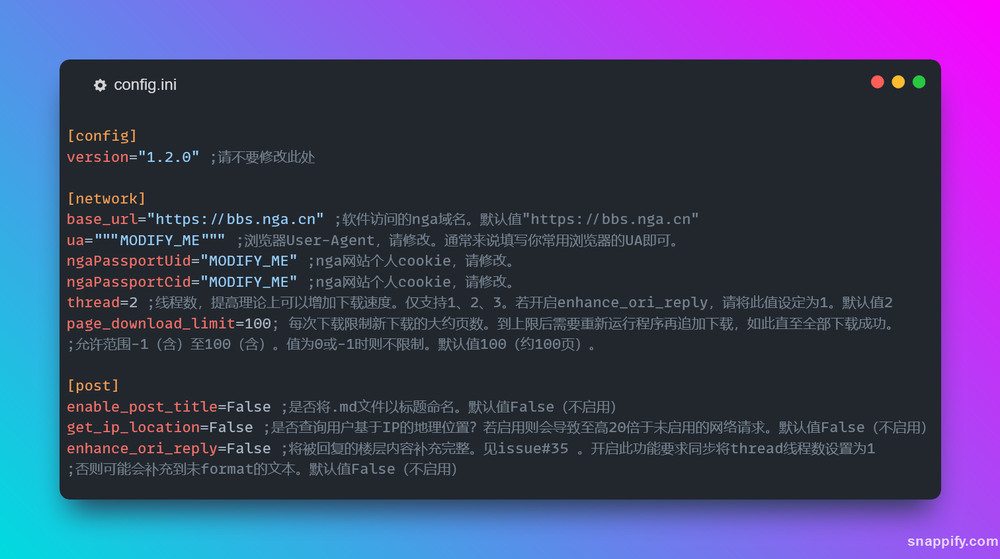

# ngapost2md ver.[NEO_1.1.1]

快速爬楼存回复人+时间+内容，支持保存正文图片、音视频等，支持常见 bbcode 格式（具体见 README 后半部分）。

**此为 2023 年由 Go 语言重写的版本。倘若需要旧版 Python 版代码（不再维护），请切换分支至 LEGACY**

## 使用指引

1. 确保 `config.ini`  文件存在且与可执行文件在同一目录下（平级关系）
2. 修改 `config.ini`  内的 `MODIFY_ME` 内容为相关内容
3. 带参数（参数为帖子 tid）运行可执行文件，如 (Linux) `./app 5935947` 或者 (Windows) `.\app.exe 5935947`

### 图片快速指引

## 资瓷与不资瓷格式说明

资瓷的有：

- newline 换行
- pic 图片（会下载下来）
- smile 表情（只是引用在线资源）
- quote 回复与引用（阔以 jump 和 append 在最后 [#12](https://github.com/ludoux/ngapost2md/issues/12)）（多个 quote [#33](https://github.com/ludoux/ngapost2md/issues/33)）
- strikeout 删除线
- url 超链接
- ~~align 对齐~~ 目前 Go 版本不支持
- ~~collapse 折叠 （[#10](https://github.com/ludoux/ngapost2md/issues/10)）~~ 目前 Go 版本不支持
- anony 匿名 （[#11](https://github.com/ludoux/ngapost2md/issues/11)）
- ~~audio 音频 （[#15](https://github.com/ludoux/ngapost2md/issues/15)）~~ 目前 Go 版本不支持
- ~~video 音频~~ 目前 Go 版本不支持
- 用户基于 IP 的位置 （[#45](https://github.com/ludoux/ngapost2md/pull/45)）

不资瓷并且常出现的有：

- 字体颜色啊大小之类的格式
- 表格之类的复杂排版

## Special Thanks

- 特别感谢 [crella6](https://github.com/crella6) 的捉虫以及意见！
- 感谢 [proItheus](https://github.com/proItheus) 及 [zsq @oarinv](https://github.com/oarinv) 对此项目的帮助！
